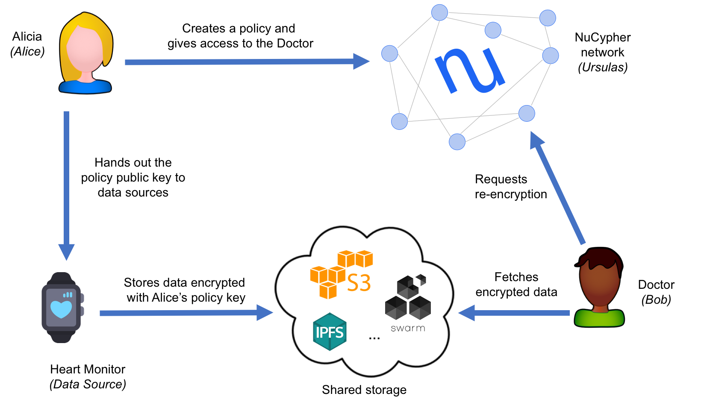

# NuCypher's Heartbeat Demo



Alicia has a Heart Monitor device that measures her heart rate and outputs this data in encrypted form. Since she thinks that she may want to share this data in the future, she uses NuCypher to create a _policy public key_ for the Heart Monitor to use, so she can read and delegate access to the encrypted data as she sees fit. The Heart Monitor uses this public key to produce a database with some amount of encrypted heart rate measurements; this database can be located on some storage service (e.g., IPFS, S3, whatever). 

At some moment, she wants to share this information with other people, such as her Doctor. Once she obtains her Doctor's public keys, she can create a policy in the NuCypher network granting access to him. After this, her Doctor can read the encrypted database (which was populated by the Heart Monitor) and request a re-encrypted ciphertext for each measurement, which can be opened with the Doctor's private key.

This simple use case showcases many interesting and distinctive aspects of NuCypher:
  - Alicia can create policy public keys **before knowing** who can be the potential consumers.
  - Alicia, or any one knowing the policy public key (e.g., the Heart Monitor), can produce encrypted data that belongs to the policy. Again, this can happen before granting access to any consumer.
  - As a consequence of the previous point, Data Sources, like the Heart Monitor, are completely unaware of the recipients. In their mind, they are producing data **for Alicia**.
  - Alicia never interacts with the Doctor: she only needs the Doctor's public key.
  - Alicia only interacts with the NuCypher network for granting access to the Doctor. After this, she can even disappear from the face of the Earth.
  - The Doctor never interacts with Alicia or the Heart Monitor: he only needs the encrypted data and some policy metadata.

### How to run the demo
Install dependencies (only for the first time):
```sh
$ pipenv install --pre --skip-lock --dev
```

Run the demo:
```sh
$ pipenv shell

(nucypher)$ python streaming_heartbeat.py
```

* The characters can be viewed at [http://127.0.0.1:8050/](http://127.0.0.1:8050/)
